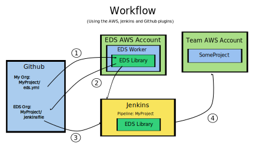

# EDS

The Extensible Deployment System (EDS)

## Overview

* Configure deployments using a single `eds.yml` file.
* Inherit from parent `eds.yml` files to keep configurations DRY.
* Extendable using plugins.
* Open source.



1. Commits to "MyProject" sends a Github event to the EDS Worker.
2. EDS Worker uses the EDS Library to:
   * Create "MyProject" in the EDS org to hold the pipeline configuration.
   * Create a corresponding "MyProject" pipeline in Jenkins.
   * Write a Jenkinsfile that will deploy "MyProject" as specified by
     `eds.yml`. The Jenkinsfile is configured to deploy the version of
     "MyProject" that triggered the Event.
3. The commit to "MyProject" triggers the corresponding pipeline.
4. The pipeline uses the EDS Library to build, test, and deploy "MyProject".

## Installation

```bash
pip install eds
```

Create a project with an `eds.yml` file:

```yaml
version: 1.0.0
plugins:
    < wave of hands >
```

Run:

```bash
./eds
```

The output will contain the webhook URL for your EDS worker.  Add a webhook
from your project to this URL.


## Usage

To use EDS, projects must include a `eds.yml` file at the root of their project,
and add a GitHub hook that points to the EDS Worker using the URL obtained
during installation.

The specification for "eds.yml" files, is like so:

```yaml
version:
include:
plugins:
    - id:
      name:
      pip_requirement:
      inheritance:
      properties:

```

* `version`: (required) The version of EDS to use.
* `include`: (optional) A list of `eds.yml` VCS file paths to include plugins
  from. Their plugin ids will be prefixed with the VCS file path to make them
  unique.
* `plugins`: (required) A list of plugin configurations.
    * `id`: (required) An id to refer to this plugin configuraton.
    * `name`: (required) The name of the plugin to be used.
    * `pip_requirement`: (optional) The requirement used to `pip install` the
      plugin. Not required if using built-in plugins.
    * `inheritance`: (optional) A list of plugin configuration ids to inherit
      from.  Precedence is such that properties from later items override
      earlier ones.
    * `properties`: (optional) properties dictionary.


## Built-in Plugins

* [eds.config.aws_worker](./eds/plugins/config_aws_worker.py)
* [eds.config.terraform](./eds/plugins/config_terraform.py)
* [eds.pipeline.jenkinsfile](./docs/plugins/pipeline_jenkinsfile.py)
* [eds.pipeline_provider.jenkins](./eds/plugins/pipeline_provider_jenkins.py)
* [eds.tags.default](./eds/plugins/tags_default.py)
* [eds.vcs_provider.github](./eds/plugins/vcs_provider_github.py)

## Plugin Interfaces

* [eds.config](./eds/interfaces/application.py)
* [eds.pipeline](./eds/interfaces/pipeline.py)
* [eds.pipeline_provider](./eds/interfaces/pipeline_provider.py)
* [eds.tags](./eds/interfaces/tags.py)
* [eds.task](./eds/interfaces/task.py)
* [eds.vcs_provider](./eds/interfaces/vcs_provider.py)

# Upgrading

# Development

* POC Phase 1 (4/2021)
  * Write `eds.yml` v1 specification.
  * Write the v1 extension point specification.
  * Write user documentation.
* POC Phase 2 (5/2021)
  * Write v1 of eds library as a plugin framework only.  No plugins.
* POC Phase 3 (6/2021)
  * Implement core plugins:
    * `eds.worker.aws`
    * `eds.pipeline_provider.jenkins`
    * `eds.vcs_provider.github`
    * `eds.pipeline.jenkinsfile`
* POC Phase 4 (7/2021)
  * technology specific plugins...
* POS Phase 5 (8/2021)
  * Gather feedback and reaccess.